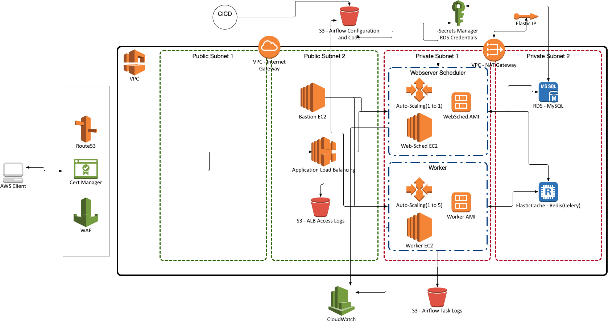

# What is this?

This is the terraform code to create the following airflow architecture.

**tf_s3_state** 

- directory contains the terraform code to create an s3 bucket to store the terraform state for the terraform code in the other directory.

**tf_new_net_rds_ec_ec2**

- directory contains the terraform code to create the complete AWS airflow stack including a new VPC, Subnets.

**tf_existing_net_rds_ec_ec2**

- directory contains the terraform code to create the complete AWS airflow stack using existing VPC's and Subnets.

**Please refer to https://github.com/turnerlabs/airflow_stack_aws_ec2_ami for creating the AMI's that run in this stack.**
